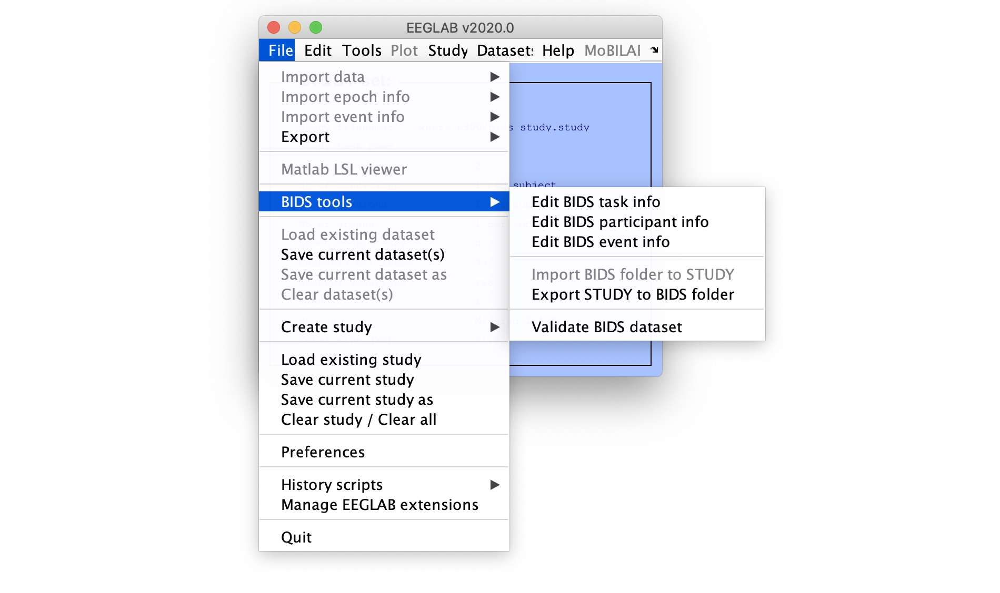
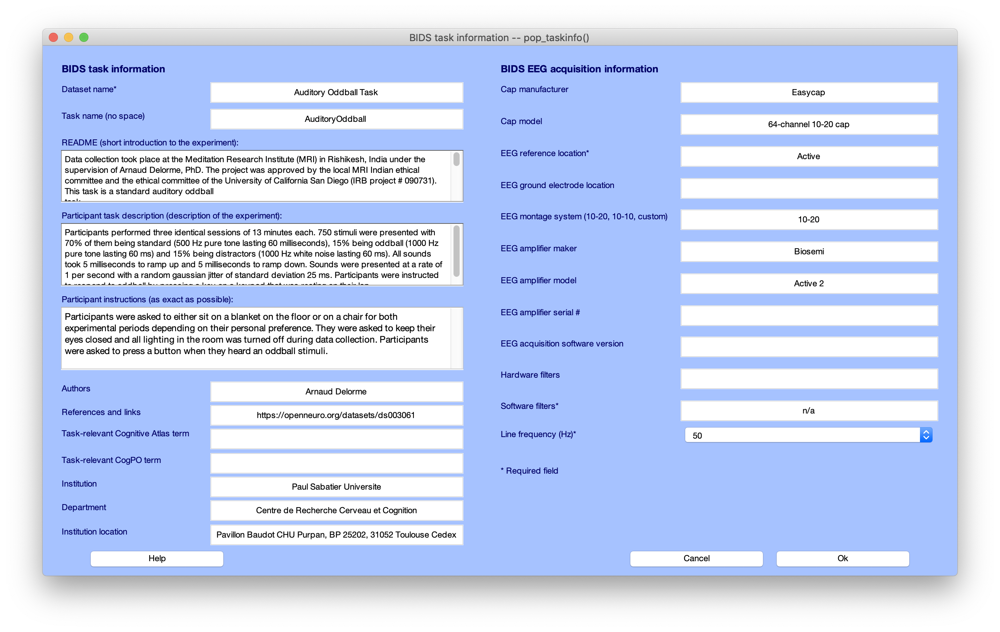
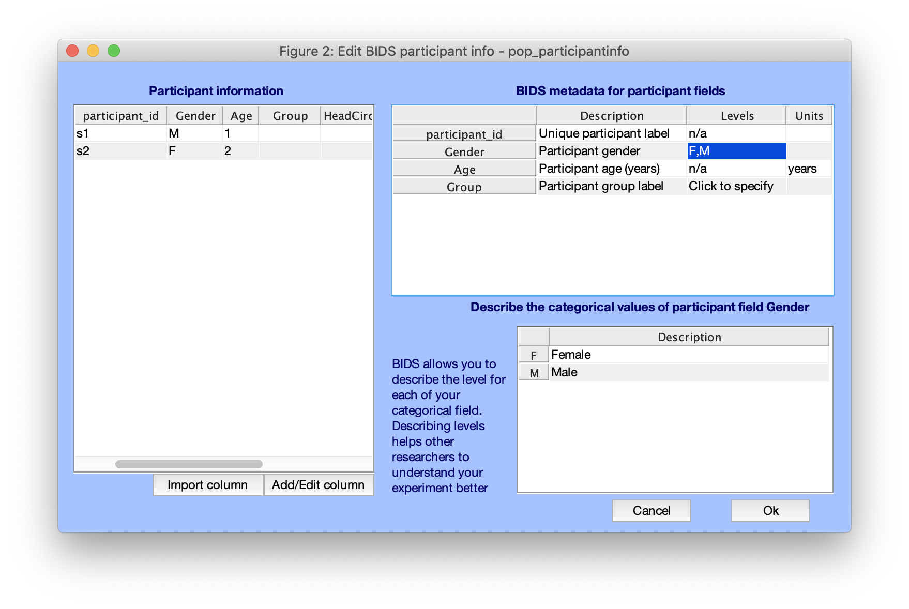
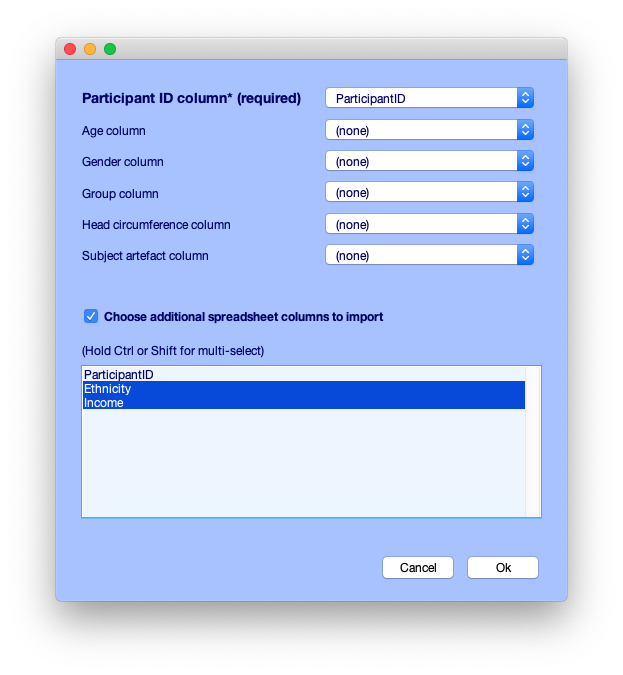
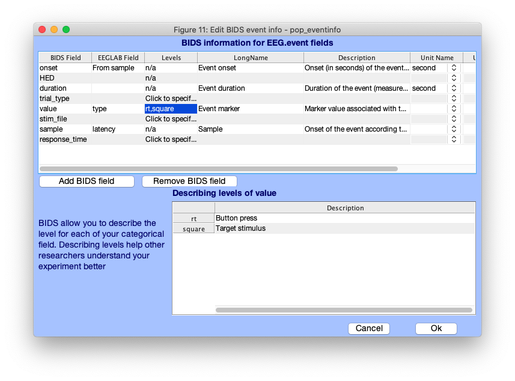

# Add BIDS metadata using bids-matlab-tools plug-in and export
## Export datasets to BIDS from the graphic interface

After installing the bids-matlab-tools plugin, the BIDS menu should appear in the EEGLAB File menu item as shown below.

We will go through the menus one by one. First the task menu. This is where you enter all the information about the task and amplifier information.

Once you are done entering task information, you can select the participant menu. There are as many rows as subjects. For each subject, you can specify age, gender, group, etc... Only the participant_id column is mandatory and other columns are optional.

Note that it is also possible to define custom columns. To do this, you can click on the "import column(s)" push button. Upon doing so, you are prompted to select a text or Excel file. Note that the first row must contain column names. After selecting the file, the following interface pops up.

You must indicate which column contains participant ID. You can also select columns for the pre-defined BIDS participant information, such as age, gender, etc... Finally, it is possible to select columns which will be added to the BIDS participant file, in this case "ethnicity" and "income".

Lastly, we fill out information about events. The GUI displays default BIDS event fields to which you can associate the corresponding EEGLAB event field in your data. *onset*, *value*, and *sample* are mapped to their corresponding EEGLAB field by default. *duration* and *HED* will also be automatically mapped if their corresponding EEGLAB field (*duration* and *usertags* respectively) exist. Custom fields can be added via the "Add BIDS field" button. Fields can also be removed via the "Remove BIDS field" button. Note that any BIDS field not mapped to EEGLAB event field will not be saved for later export.

## Export datasets to BIDS from the command line

Exporting a collection of datasets to BIDS can also conveniently be done from the command line. A documented example script [bids_export_example.m](https://github.com/sccn/bids-matlab-tools/blob/master/bids_export_example.m) and [bids_export_example2.m](https://github.com/sccn/bids-matlab-tools/blob/master/bids_export_example2.m) (more recent) are provided. You may modify these scripts for your own purpose. The help message of the function [bids_export.m](https://github.com/sccn/bids-matlab-tools/blob/master/bids_export.m) also contains information on how to export data in BIDS format. 

Note for exporting:
* Several tasks may be included in a single BIDS container. In this case, the name of the main task can be "mixed tasks" and multiple EEG datasets for different tasks can be contained in a single subject/eeg/ folder.
* Channel electrodes should not be exported by default if they are template electrode positions. This is because BIDS is about raw data. Electrode positions based on templates (averages) should therefore not be included.
