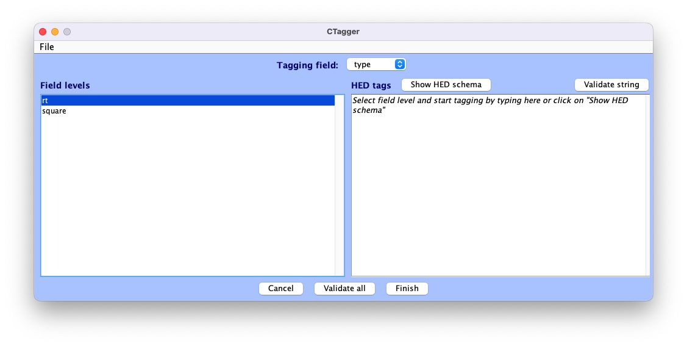
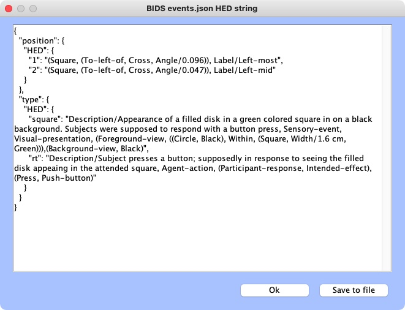
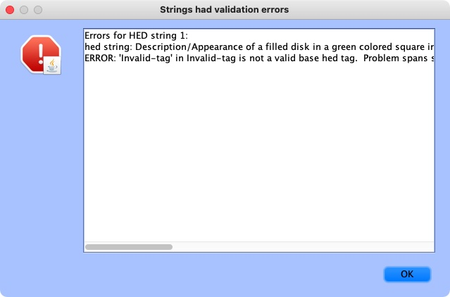
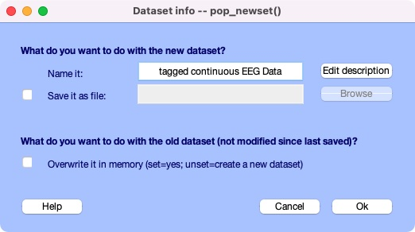

# Add HED annotation using HEDTools plug-in

## Event remapping tools
Kay's tools

## HED Annotation quickstart
This tutorial takes you through the steps of annotating the events
using HED (Hierarchical Event Descriptors).
The tutorial focuses on how to make good choices of HED annotations
to make your data usable for downstream analysis.
The mechanics of putting your selected HED annotations into
[BIDS (Brain Imaging Data Structure)](https://bids.neuroimaging.io/) format
is covered in the [**BIDS annotation quickstart**](./BidsAnnotationQuickstart.md) guide.

* [**What is HED annotation?**](what-is-hed-annotation-anchor)  
* [**A recipe for simple annotation**](a-recipe-for-simple-annotation-anchor)  

(what-is-hed-annotation-anchor)=
### What is HED annotation?

A HED annotation consists of a comma separated list of tags selected from
a HED vocabulary or schema.
An important reason for using an agreed-upon vocabulary rather than
free-form tagging for annotation is to avoid confusion and ambiguity
and to promote data-sharing.

The basic terms are organized into trees for easier access and search.
The [**Expandable HED vocabulary viewer**](https://www.hedtags.org/display_hed.html) allows
you to explore these terms.

(a-recipe-for-simple-annotation-anchor)=
### A recipe for simple annotation
In thinking about how to annotate an event, you should always start
by selecting a tag from the *Event* subtree to indicate the general event category.
Possible choices are: *Sensory-event*, *Agent-action*, *Data-feature*, *Experiment-control*,
*Experiment-procedure*, *Experiment-structure*, and *Measurement-event*.
See the [**Expandable HED vocabulary viewer**](https://www.hedtags.org/display_hed.html)
to view the available tags.

Most experiments will only have a few types of distinct events.
The simplest way to create a minimal HED annotation for your events is:

1. Select one of the 7 tags from the *Event* subtree to designate the general category of the event.  
2. Use the following table to select the appropriate supporting tags given that event type.

(standard-hed-tag-selections-anchor)=
```{admonition} Standard HED tag selections for minimal annotation.
:class: tip

|  Event tag    | Support tag type |  Example tags  | Reason | 
| ------------- | -------------------- | ------------ | ------ |
| **<em>Sensory-event</em>** | *Sensory-presentation* | *Visual-presentation*<br>*Auditory-presentation*| Which sense? | 
|              | *Task-event-role* | *Experimental-stimulus*<br>*Instructional* | What task role? | 
|              | *Task-stimulus-role* | *Cue*<br>*Target* | Stimulus purpose? |  
|              | *Item*  | *(Face, Image)*<br>*Siren* | What is presented? | 
|              | *Sensory-attribute* | *Red* | What modifiers are needed? | 
| **<em>Agent-action</em>** | *Agent-task-role* | *Experiment-participant* | Who is agent? |  
|                | *Action*          | *Move*<br>*Press* | What action is performed? | 
|                | *Task-action-type* | *Appropriate-action*<br>*Near-miss* | What task relationship? | 
|                | *Item*            | *Arm*<br>*Mouse-button* | What is action target? | 
| **<em>Data-feature</em>** | *Data-source-type* | *Expert-annotation*<br>*Computed-feature* | Where did the feature come from? |  
|                | *Label*            | *Label/Blinker_BlinkMax* | Tool name?<br>Feature type? | 
|                | *Data-value*       | *Percentage/32.5* <br>*Time-interval/1.5 s* | Feature value or type? | 
| **<em>Experiment-control</em>** | *Agent* | *Controller-Agent* | What is the controller? | 
|                      | *Informational* | *Label/Stop-recording* | What did the controller do? |
| **<em>Experiment-procedure</em>** | *Task-event-role* | *Task-activity* | What procedure? | 
| **<em>Experiment-structure</em>** | *Organizational-property* | *Time-block*<br>*Condition-variable* | What structural property? | 
| **<em>Measurement-event</em>** | *Data-source-type*  | *Instrument-measurement*<br>*Observation* | Source of the data. | 
|                | *Label*            | *Label/Oximeter_O2Level* | Instrument name?<br>Measurement type? |
|                | *Data-value*       | *Percentage/32.5* <br>*Time-interval/1.5 s* | What value or type? 
```


As in BIDS, we assume that the event metadata is given in tabular form.
Each table row represents the metadata associated with a single data event marker,
as shown in the following excerpt of the `events.tsv` file for a simple Go/No-go experiment.
The `onset` column gives the time in seconds of the marker relative
to the beginning of the associated data file. 

(example-go-no-go-event-table-anchor)=
````{admonition} Event file from a simple Go/No-go experiment.

| onset | duration | event_type | value | stim_file | 
| ----- | -------- | ---------- | ----- | --------- | 
| 5.035 | n/a | stimulus | animal_target | 105064.jpg | 
| 5.370 | n/a | response | correct_response | n/a | 
| 6.837 | n/a | stimulus | animal_distractor | 38068.jpg |
| 8.651 | n/a | stimulus | animal_target | 136095.jpg |
| 8.940 | n/a | response | correct_response | n/a |
| 10.801 | n/a | stimulus | animal_distractor | 38014.jpg |
| 12.684 | n/a | stimulus | animal_distractor | 82063.jpg |
| 12.943 | n/a | response | incorrect_response | n/a |
````

In the Go/No-go experiment, the experimental participant is presented
with a series of target and distractor animal images.
The participant is instructed to lift a finger off a button
when a target animal image appears.
Since in this experiment, the `value` column has distinct values
for all possible unique event types, the `event_type` column is redundant.
In this case, we can choose to assign all the annotations to
the `value` column as demonstrated in the following example.

````{admonition} Version 1: Assigning all annotations to the value column.

| value | Event category |  Supporting tags |  
| ------- | -------------- | --------------- |   
| animal_target | *Sensory-event* | *Visual-presentation*, *Experimental-stimulus*,<br>*Target*, (*Animal*, *Image*) |  
| animal_distractor | *Sensory-event* | *Visual-presentation*, *Experimental-stimulus*,<br>*Non-target*, *Distractor*, (*Animal*, *Image*) |  
| correct_response | *Agent-action* | *Experiment-participant*, (*Lift*, *Finger*), *Correct-action* |  
| incorrect_response | *Agent-action* | *Experiment-participant*, (*Lift*, *Finger*), *Incorrect-action* |  

````

The table above shows the event category and the supporting tags as suggested in the
[**Standard hed tags for minimal annotation**](standard-hed-tag-selections-anchor) table.

A better format for your annotations is the 
[**4-column spreadsheet format**](four-column-spreadsheet-format-anchor) described in
[**BIDS annotation quickstart**](BidsAnnotationQuickstart.md), since there are online
tools to convert this format into a JSON sidecar that can be deployed directly in
a BIDS dataset. 

````{admonition} 4-column spreadsheet format for the previous example.

| column_name| column_value | description | HED |  
| ------- | -------------- | ----------- | ------- |  
| value | animal_target | An target animal image was<br>presented on a screen. |*Sensory-event*, *Visual-presentation*,<br>*Experimental-stimulus*,<br>*Target*, (*Animal*, *Image*) |  
| value | animal_distractor | A non-target animal distractor<br>image was presented<br>on a screen.  | *Sensory-event*, *Visual-presentation*,<br>*Experimental-stimulus*, *Non-target*,<br>*Distractor*, (*Animal*, *Image*)|  
| value | correct_response | Participant correctly<br>lifted finger off button.  | *Agent-action*, *Experiment-participant*,<br>(*Lift*, *Finger*), *Correct-action* |  
| value | incorrect_response | Participant lifted finger off<br>the button but should not have. | *Agent-action*, *Experiment-participant*,<br>(*Lift*, *Finger*), *Incorrect-action* |  

````

HED tools assemble the annotations for each event into a single HED tag string.
An exactly equivalent version of the previous example splits the HED tag annotation between
the `event_type` and `value` columns as shown in the next example.

````{admonition} Version 2: Assigning annotations to multiple event file columns.

| column_name | column_value | description | HED |  
| ------- | -------------- | --------------- | ------ |  
| event_type | stimulus | An image of an animal<br>was presented on a<br>computer screen.| *Sensory-event*, <br>*Visual-presentation*,<br>*experimental-stimulus* |  
| event_type | response | Participant lifted finger<br>off button.| *Agent-action*,<br> *Experiment-participant*,<br>(*Lift*, *Finger*) |  
| value | animal_target | A target animal image. | *Target*, (*Animal*, *Image*) |  
| value | animal_distractor | A non-target animal image<br>meant as a distractor. | *Non-target*, *Distractor*,<br>(*Animal*, *Image*) |  
| value | correct_response | The previous stimulus<br>was a target animal. | *Correct-action* |  
| value | incorrect_response | The previous stimulus<br>was not a target animal. | *Incorrect-action* |  
| stim_file | n/a | Filename of stimulus image. | (*Image*, *Pathname/#*) |  
````
In version 2, the annotations that are common
to all stimuli and responses are assigned to `event_type`.
We have also included the annotation for the `stim_file` column in the last row
of this table. 

The assembled annotation for the first event (with onset 5.035) in the 
[**event file excerpt from go/no-go**](example-go-no-go-event-table-anchor) above is:

> *Sensory-event*, *Visual-presentation*, *Experimental-stimulus*, *Target*, (*Animal*, *Image*), (*Image*, *Pathname/105064.jpg*)

Mapping annotations and column information across multiple column values often makes
the annotation process simpler, especially when annotations become more complex.
Multiple column representation also can make analysis easier,
particularly if the columns represent information such as design variables.

See [**BIDS annotation quick start**](BidsAnnotationQuickstart.md#bids-annotation-quickstart) for how to
create templates to fill in with your annotations using online tools.
Once you have completed the annotation and converted it to a sidecar,
you simply need to place this sidecar in the root directory of your BIDS dataset.

## Add HED Annotation in EEGLAB
HED is fully integrated into EEGLAB via the *HEDTools* plug-in, allowing users to annotate their
EEGLAB STUDY and datasets with HED,
as well as enabling HED-based data manipulation and processing.

### Installing *HEDTools*

*HEDTools* EEGLAB plug-in can be installed using one of the following ways:

#### Method 1: EEGLAB Extension Manager: 

Launch EEGLAB. From the main GUI select:

> **File --> Manage EEGLAB extension**

The extension manager GUI will pop up. 

From this GUI look for and select the plug-in *HEDTools* from the main window,
then click into the *Install/Update* button to install the plug-in.


#### Method 2: Download and unzip

Download the zip file with the content of the plug-in *HEDTools* either from
[**HED Matlab EEGLAB plugins**](https://github.com/hed-standard/hed-matlab/blob/master/EEGLABPlugin)
or from the EEGLAB [**plug-ins summary page**](https://sccn.ucsd.edu/eeglab/plugin_uploader/plugin_list_all.php). 

Unzip file into the folder *../eeglab/plugins* and restart the *eeglab* function in a MATLAB session.

(annotating-datasets-anchor)=
### Annotating datasets

We will start by adding HED annotations to the EEGLAB tutorial dataset.

After installing the *HEDTools* open the EEGLAB main window and load the dataset by selecting the menu item:  

> **File --> Load existing dataset** .

Selecting the tutorial dataset under your eeglab installation _eeglab/sample_data/eeglab_data.set_. 

Read a description of the dataset and of its included event codes by selecting:  

> **Edit --> About this dataset**:


The description gives a general idea of the codes found in the event structure.
Yet, inquisitive researchers interested in the nature of the stimuli
(e.g., color and exact location of the squares on the screen)
would have to look up the referenced paper for details.

Our goal in using HED tags is to describe the experimental events that are recorded 
in the *EEG.event* data structure in sufficient detail that anyone using the dataset
in the future will not need to find and read a separate, detailed description of the dataset
or study to understand the recorded experimental events. 
As demonstrated below, such annotation will allow us to extract epochs using meaningful
HED tags instead of the alpha-numeric codes often associated with shared EEG data.

#### Launching EEGLAB HEDTools
To add and view HED tags for the dataset, from EEGLAB menu, select:  

> **Edit --> Add/Edit event HED tags**.  

_HEDTools_ will extract information from the *EEG.event* structure,
automatically detecting the event structure fields and their unique values.  

The _HEDTools_ ignore the fields the event structure fields *.latency*, *.epoch*, and *.urevent*. 

A window will appear asking you to verify/select categorical fields:


Here both *position* and *type* are categorical fields. 
*HEDTools* automatically selects fields with less than 20 unique values to be categorical,
but the user can modify which values are chosen.

CTagger (for 'Community Tagger') is a graphical user interface (GUI) built to facilitate
the process of adding HED tags to recorded events in existing datasets.
Clicking *Continue* brings up the *CTagger* interface:



The CTagger GUI is organized using a split window strategy.
The left window shows the items to be tagged,
and the right window shows the current HED tags associated with the selected item.
The *Show HED schema* button brings up a browser for the HED vocabulary. 

Through the CTagger GUI, users can explore the HED schema,
quickly look up and add tags (or tag groups) to the desired event codes,
and use import/export features to reuse tags on from other data recordings in the same study.

The process of tagging is simply choosing tags from the available vocabulary
(using the HED schema browser) and associating these tags with each event code.

Once familiar with HED and the vocabulary, most users just type the tags directly in the tag window
shown on the right. 

CTagger is used as part of the HEDTools plug-in in this tutorial,
but it can also be used as a standalone application. 

Instructions on downloading and using the standalone version of CTagger,
as well as step-by-step guide on how to add HED annotation with CTagger,
can be found at in [**Tagging with CTagger**](./TaggingWithCTagger.md).

#### Tagging the events
A brief step-by-step guide to selecting tags can be found at
[**HED annotation quickstart**](./HedAnnotationQuickstart.md).
The following shows example annotations using the process suggested in the quickstart. we will import the annotation saved in the _events.json file format. 
Download the file [**eeglab-tutorial_events.json**](./_static/data/eeglab-tutorial_events.json) then select:

> **File --> Import --> Import BIDS events.json file**

to import it to CTagger. You can now review all the tags via:

> **File --> Review all tags** 



#### Validation
The last step of the annotation process is to validate the HED annotations.
Click on the *Validate all* button at the bottom pane.
A window will pop up showing validation results.
If there are issues with the annotation, there will be a line for each of the issues found.

Here is an example of validation log file with issues:



If the annotation was correct, a message will appear confirming the validity:


Click *Finish* on the main CTagger window to end the annotation. 

The tag review window will show up again for a final review and the option to save
the annotation into an _events.json file for distribution just as with the *eeglab-tutorial_events.json*.
Hit *Ok* to continue after that.

A last window will pop up asking what you would like to overwrite the old dataset with the
tagged one or save new dataset as a separate file. Click **Ok** when you're done. 



You just finished tagging! *HEDTools* generates the final HED string for each event
by concatenating all tags associated with the event values of that event (separated by commas).
The final concatenated version is put the string in a new field **HED** in EEG.event. 
