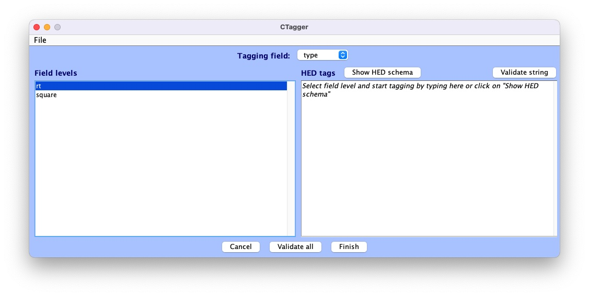
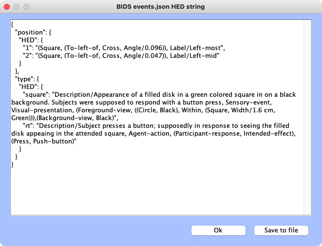

# Import data to EEGLAB
## Import BIDS dataset using the EEGLAB bids-matlab-tools plug-in

The EEGLAB menu to import a BIDS dataset into an EEGLAB study is fully functional. Screen capture is shown below.

Raw EEG data file often has events. However, BIDS also define events in dedicated event files. Sometimes the BIDS event files contain more information than the raw EEG data file. In that case, users may choose to overwrite raw EEG data events with the event information contained in the BIDS event files.

Similarly, raw EEG data files often define channel labels. However, BIDS also defines channel labels and channel locations in dedicated event files. By pressing the second checkbox, users may choose to use the channel label and location information contained in the BIDS channel definition files.

Finally, users may select an output folder for storing their EEGLAB STUDY. If a folder is not selected, EEGLAB will store STUDY files ''in place'' which means in the BIDS folder structure - resulting in the BIDS folder becoming non-BIDS compliant and failing to pass BIDS validation because of the additional EEGLAB files.

## View HED annotation
HED is fully integrated into EEGLAB via the *HEDTools* plug-in, allowing users to annotate their
EEGLAB STUDY and datasets with HED, as well as enabling HED-based data manipulation and processing.

### Installing *HEDTools*

*HEDTools* EEGLAB plug-in can be installed using one of the following ways:

#### Method 1: EEGLAB Extension Manager: 

Launch EEGLAB. From the main GUI select:

> **File --> Manage EEGLAB extension**

The extension manager GUI will pop up. 

From this GUI look for and select the plug-in *HEDTools* from the main window,
then click into the *Install/Update* button to install the plug-in.

#### Method 2: Download and unzip

Download the zip file with the content of the plug-in *HEDTools* either from
[**HED Matlab EEGLAB plugins**](https://github.com/hed-standard/hed-matlab/blob/master/EEGLABPlugin)
or from the EEGLAB [**plug-ins summary page**](https://sccn.ucsd.edu/eeglab/plugin_uploader/plugin_list_all.php). 

Unzip file into the folder *../eeglab/plugins* and restart the *eeglab* function in a MATLAB session.

### Reviewing HED annotations via the EEGLAB HEDTools plug-in
To add and view HED tags for the dataset, from EEGLAB menu, select:  

> **Edit --> Add/Edit event HED tags**.  

_HEDTools_ will automatically detect HED annotations existed for the dataset imported from BIDS. It will then launch CTagger (for 'Community Tagger'), a graphical user interface (GUI), built to facilitate the process of adding and reviewing HED tags to recorded events in existing datasets.

The CTagger GUI is organized using a split window strategy.
The left window shows the items to be tagged,
and the right window shows the current HED tags associated with the selected item.

You can now review all the tags via CTagger menu:

> **File --> Review all tags** 

