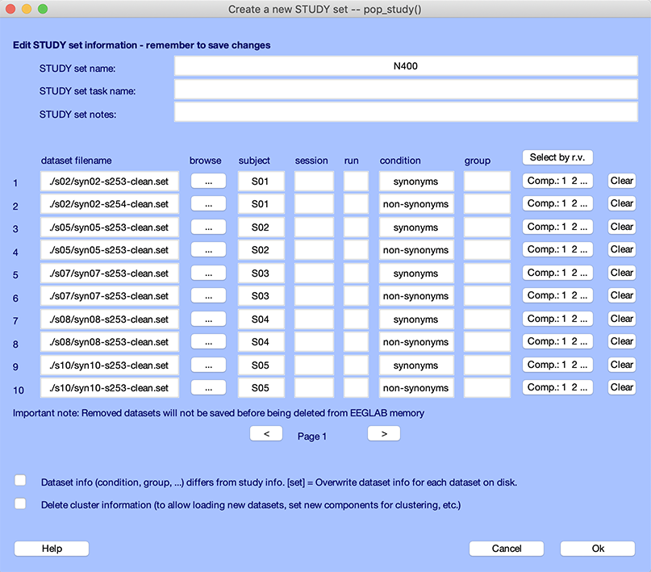
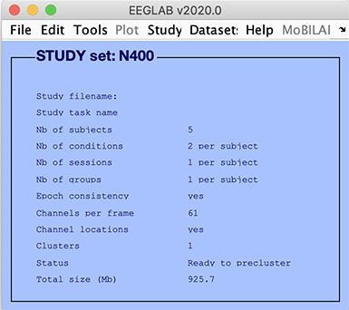

# Organize your EEGLAB datasets to STUDY
## Creating a STUDY

This part of the tutorial will demonstrate how to create an EEGLAB
STUDY and perform simple plotting. 
An EEGLAB STUDY (or study) contains descriptions of and links to data
contained in many epoched or continuous datasets, for example, a set of
datasets from a group of subjects in one or more conditions of the
same task or performing different tasks in the same or different
sessions. We use a *STUDY* to manage and process data recorded from multiple subjects, sessions, and/or conditions of an experimental study. 

## Creating a new STUDY
To create a *STUDY*, select the
 File → Create study → Browse for datasets menu item.

Another option is to load into
EEGLAB all the datasets you want to include in the study and select
the 
File → Create study → Using all loaded datasets menu item. 
A blank interface similar to the one described below
will appear. In this window, enter a name for the *STUDY*
('N400'), and a short description of the study ('Auditory task:
Synonyms Vs. Non-synonyms, N400'). 

Here, we do not add notes about the
study, but we recommend that you do so for your own studies. The
accumulated notes will always be loaded with the study, easing later
analyses, and re-analyses. Note that here the fields *Subject* and *Condition* (above) have been filled
automatically. This is because the datasets already contained this
information. For instance, if you were to load this dataset into
EEGLAB by selecting the Edit → Dataset info menu item, you would be able to edit the *subject*, *condition*, *group*, *session*, and *run* for this dataset. You may also edit this information within the study itself. The dataset information and study dataset information may be different to ensure maximum flexibility, although we recommend checking the checkbox *Update dataset info...* to keep them consistent.

Click on the *Browse* button in the first blank location and select a dataset name. Do so for other datasets as well. 

The interface window should then look like the following:

Below, we detail what the *STUDY* terms *subject*, *session*, *run*, *condition*, and *group* mean.

- The top of the window contains information about the STUDY, namely its
running name, the extended task name for the STUDY, and some notes.
- The next section contains information about the 10 datasets that are
part of the STUDY. For each dataset, we have specified a subject code
and condition name. 
- For each file, you may assign a session and run number. A run is when there are blocks in an experiment, and the data from each block is stored in a separate file. Sessions are used when the data is collected on different days or when there is a break that involves removing the EEG cap. We chose to leave the session and run empty since there are irrelevant for this *STUDY* (there is only one session and one run per subject).
- The *condition* column contains the condition associated with each file. Note that we have two files here per subject. However, it is also possible to have a single file per subject and to define conditions using EEGLAB event trial types. For more information on this topic, read the [STUDY design tutorial](/tutorials/10_Group_analysis/working_with_study_designs.html).
- The *group* column indicates the group a subject belongs to. This is irrelevant for this STUDY since there
was only one subject group.
- We will come back later to the *Select by r.v.* (select ICA component by residual variance) and the *Comp...* button when we perform ICA component clustering.
- Pressing the *Clear* button clears the information on a given row.

In general, we prefer the dataset information to be consistent with
the *STUDY* information -- thus, we may check the first checkbox. The second checkbox removes all current cluster information and will be explained when we perform ICA component clustering.

After you have finished adding datasets to the study, press *Ok* in the [pop_study.m](http://sccn.ucsd.edu/eeglab/locatefile.php?file=pop_study.m) GUI to import all the datasets.

We strongly recommend that you also save the *STUDY* by selecting the EEGLAB
menu item File → Save study as after closing the [pop_study.m](http://sccn.ucsd.edu/eeglab/locatefile.php?file=pop_study.m) window.

## Loading an existing STUDY
Either use the studyset created in the previous section or load
another studyset. To load a studyset, select the File → Load existing study menu item. Select the file
*N400.study* in the folder *STUDY5subjects*. After loading or creating a
study, the main EEGLAB interface should look like this:

In the EEGLAB GUI (above): 
- *Epoch consistency* indicates whether or
not the data epochs in all the datasets have the same lengths and
limits.
- *Channels per frame* indicates the number of channels in each
of the datasets (*It is possible to process datasets with different
numbers of channels*).
- *Channel location* indicates whether or not
channel locations are present for all datasets. 
- *Clusters*  indicates the number of component clusters associated
with this STUDY. There is always at least one cluster associated with
a STUDY. This contains all the pre-selected ICA components from all
datasets.
- *Status* indicates the current status of the
STUDY. In the case above, this line indicates that the STUDY is ready
for pre-clustering. 

To list the datasets in the STUDY, use the
Study → Edit study info menu item. The interface described in the previous section will pop up.

## Editing STUDY datasets
Selecting an individual dataset from the
Datasets menu item allows editing individual
datasets in a *STUDY*. 

Note, however, that creating new datasets or
removing datasets will also remove the *STUDY* from memory since the
study must remain consistent with datasets loaded in memory (EEGLAB will prompt you to save the *STUDY* before it is deleted).
